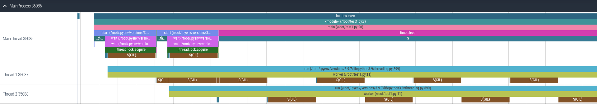
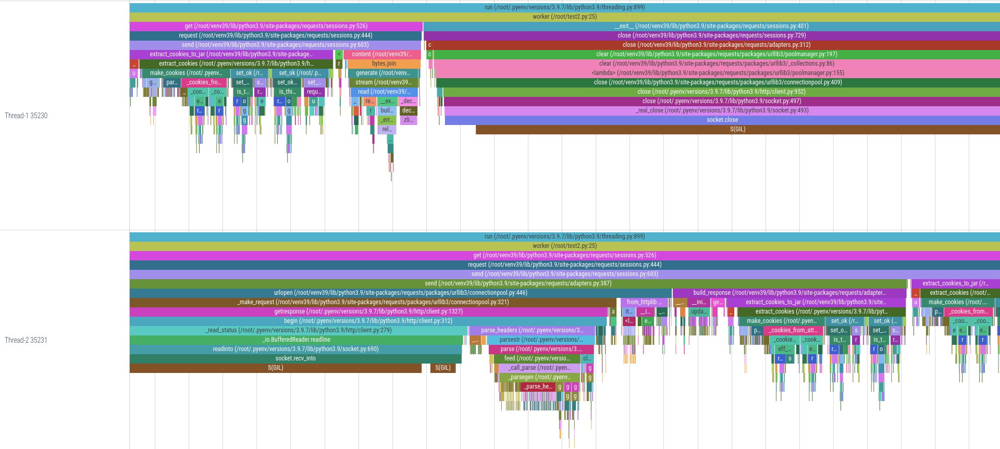

+++
title = "Tracing the python GIL with perf"
date = "2023-09-17T21:16:25+01:00"
author = ""
cover = ""
categories = ["Linux", "Troubleshooting"]
tags = ["gil", "perf", "python", "tracing"]
keywords = ["gil", "perf", "python", "tracing"]
hideComments = false
description = "Exploring the behavior of Python's Global Interpreter Lock (GIL) using `perf` and `VizTracer`"
+++

#### Introduction:

In the vast world of Python development, performance optimization is a frequent topic of discussion. One such aspect that often comes into play, especially in multi-threaded applications, is the Python [Global Interpreter Lock](https://docs.python.org/3/glossary.html#term-global-interpreter-lock) (GIL). Recently, while troubleshooting a Python tool, I delved deep into understanding and visualizing the GIL's behavior. Here's my journey...

---

While working on a Python tool designed to scrape a large number of sites, I noticed that simply increasing the number of threads didn't yield any performance improvements.

It appeared that the Python GIL was hindering the full utilization of all available CPU cores on the system due to thread contention and context switching.

Several attempts have been made in the past to mitigate the Python `GIL`. The most recent proposal, [PEP 703](https://peps.python.org/pep-0703/), seems promising. When I tested it, adding more threads did improve the runtime, but only up to 256 threads. Beyond that, it seemed we were hitting thread contention again.

Once I confirmed that the GIL was the bottleneck, I decided to delve deeper and try to visualize its behavior using the Linux [perf(1)](https://www.man7.org/linux/man-pages/man1/perf.1.html) tool and [VizTracer](https://github.com/gaogaotiantian/viztracer).

There is an existing project, [per4m](https://github.com/maartenbreddels/per4m/), that visualizes the GIL (or more accurately, process states). However, my goal was to create a simplified version using [perf-script(1)](https://www.man7.org/linux/man-pages/man1/perf-script.1.html).

> **NOTE:** `perf` is a core Linux tracing tool that's included in the kernel source. To leverage its scripting capabilities, it must be compiled with scripting support enabled.
>
> The script also relies on specific internal function calls within CPython's implementation. Given this, there's no guarantee that these functions or their behaviors will remain consistent in future releases.
>
> I used [Rocky Linux 9](https://rockylinux.org/) in my case, and all commands were executed as `root` for simplicity.

#### Setup:

- install `perf`:

```sh-session
# dnf install perf
```

- clone the repository:

```sh-session
# git clone --depth 1 git@github.com:s-sebastian/perf-tools.git
```

- copy the scripts to the `PERF_EXEC_PATH`:

```bash-session
# export PERF_EXEC_PATH=/usr/libexec/perf-core
# cp -a ~/perf-tools/scripts/* "${PERF_EXEC_PATH}/scripts/"
sudo chown -R root:root /usr/libexec/perf-core/scripts
```

- set up the Python virtual environment and install `VizTracer`:

```sh-session
# python -m venv ~/venv
# source ~/venv/bin/activate
# python -m pip install viztracer
```

#### Usage:

For testing, I used a simple script that spawns two CPU-bound threads:

```python
#!/usr/bin/env python

import time
from threading import Thread

N = 2

def worker():
    total = 0
    for i in range(1_000_000):
        total += i
    return total

def main():
    threads = []
    for _ in range(N):
        t = Thread(target=worker)
        t.start()
        threads.append(t)
    time.sleep(0.2)
    for t in threads:
        t.join()

if __name__ == "__main__":
    main()
```

Next, run the script and record its profile:

```sh-session
# perf script record python-gil-tracer viztracer --ignore_frozen -o result.json test.py
```

Execute the script to generate the results:

```sh-session
# perf script report python-gil-tracer
```

Combine all reports into a single report:

```sh-session
# python -m viztracer --combine gil_trace.json result.json -o report.json
```

The final step is to open and analyse the report using `viztracer`, which is powered by the [Perfetto](https://perfetto.dev/) stack, a toolset for performance instrumentation and trace analysis:

```sh-session
$ vizviewer report.json
```

From this visualization, it's evident that the GIL prevents threads from running in parallel, as indicated by the threads regularly entering a sleeping state, denoted by the `S(GIL)` trace events:



When we modify the thread worker function to make an HTTP request, it becomes clear that while one thread is blocked (waiting on the GIL), the other thread is occupied with parsing the response and extracting cookies. Due to the Python GIL, even these tasks can prevent other threads from executing concurrently, leading to potential bottlenecks in multi-threaded applications:



You can find the `perf` scripts on GitHub at [perf-tools](https://github.com/s-sebastian/perf-tools).

#### Resources:

- [Linux perf Examples](https://www.brendangregg.com/perf.html)
- [Trace Event Format](https://docs.google.com/document/d/1CvAClvFfyA5R-PhYUmn5OOQtYMH4h6I0nSsKchNAySU/preview#heading=h.yr4qxyxotyw)
